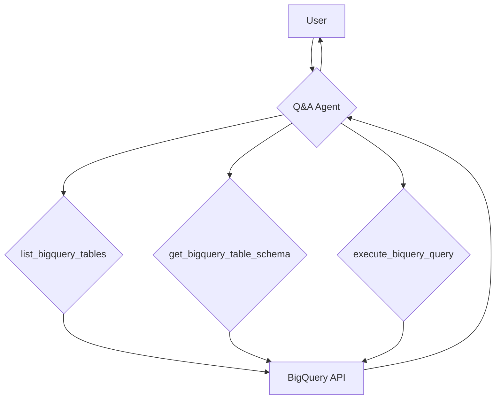
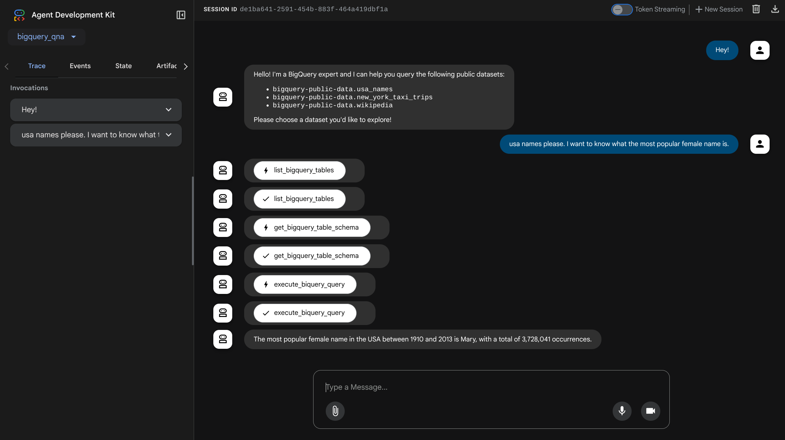

# BigQuery Conversational Agent

[](https://opensource.org/licenses/MIT)

This repository contains a powerful, conversational AI agent designed to interact with Google BigQuery. This entire repository, including this README, was generated by the **Gemini CLI**, demonstrating a new paradigm in AI-assisted software development.

This project was developed as a demonstration of the power and simplicity of building sophisticated AI agents with Google's next-generation tools.

## Key Features

*   **Natural Language Interaction**: Ask complex questions about your data in plain English.
*   **Dynamic Dataset and Table Discovery**: The agent isn't limited to a single table. It can explore all tables within a selected BigQuery dataset.
*   **Intelligent Schema Handling**: Automatically retrieves and understands table schemas, including complex features like partitioned tables.
*   **Automated SQL Generation**: Translates natural language questions into valid and efficient BigQuery SQL.
*   **Conversational Workflow**: Maintains context, allowing for follow-up questions and a natural conversational flow.

## Architecture: The Agent and its Tools

The agent uses a single, powerful `LlmAgent` that is equipped with a set of specialized tools to interact with BigQuery. This architecture allows the agent to dynamically plan and execute the steps needed to answer a user's question.



*   **Q&A Agent**: The core of the system, this agent is responsible for understanding the user's intent, planning the necessary steps, and generating the final response.
*   **`list_bigquery_tables`**: This tool allows the agent to discover all the tables within a given BigQuery dataset.
*   **`get_bigquery_table_schema`**: This tool retrieves the schema and metadata for a specific table, including crucial information about partitioning and clustering.
*   **`execute_biquery_query`**: This tool executes a BigQuery SQL query and returns the results to the agent.

## Extending to Your Own Data

While this demonstration uses a curated list of BigQuery public datasets, the agent's architecture is designed to be easily extended to your own private BigQuery data. By updating the agent's instructions in `agent.py`, you can point it to your own GCP projects and datasets. The agent's dynamic table and schema discovery capabilities will work seamlessly with your internal data, allowing you to create a powerful, conversational interface for your own business intelligence.

## Getting Started

### Prerequisites

*   Python 3.9+
*   A Google Cloud Platform (GCP) project with the BigQuery and Vertex AI APIs enabled.
*   The `gcloud` CLI installed and authenticated.

### Installation

1.  **Clone the repository:**

    ```bash
    git clone https://github.com/sandipdatta/bigquery_qna.git
    cd bigquery_qna
    ```

2.  **Set up a virtual environment:**

    ```bash
    python3 -m venv .venv
    source .venv/bin/activate
    ```

3.  **Install dependencies:**

    ```bash
    pip install -r requirements.txt
    ```

4.  **Configure your environment:**

    Create a `.env` file in the project root and add your GCP project details:

    ```env
    GOOGLE_CLOUD_PROJECT="your-gcp-project-id"
    GOOGLE_CLOUD_LOCATION="your-gcp-region"
    GOOGLE_GENAI_USE_VERTEXAI="True"
    ```

    Replace `your-gcp-project-id` and `your-gcp-region` with your specific GCP information.

### Running the Agent

You can run the agent in two ways:

#### 1. Command-line Test Agent

To start the agent and run the example conversation from your terminal, execute the following command:

```bash
python3 -m bigquery_qna.test_agent
```

#### 2. Interactive Web UI

For a rich, interactive experience, you can use the `adk web` command. This will launch a local web server with a chat interface where you can interact with the agent, inspect the conversation trace, and see the agent's state.

```bash
adk web .
```

This will open a new tab in your browser. Select the `bigquery_qna` agent from the dropdown to start a conversation.

Here is what the interactive web UI looks like:



## The Power of the Gemini CLI: Building the Agent

This entire agent was built conversationally using the Gemini CLI. This approach demonstrates a new paradigm in software development where the developer acts as a guide and architect, while the AI handles the detailed implementation.

Here are some of the actual prompts used to create this agent:

> **Initial Idea:** "I would like to build a sample agent/agentic workflow which analyses some data in BigQuery and enables an end user to have a conversation with their data. I would like to build this using biquery public datasets. Can you help me with this by updating the existing files in the qna_agent?"

> **Refining the Workflow:** "hey, lets make this far more simple from a discovery perspective. First lets make the user specify what dataset they want to query. They must provide the exact name of the dataset that they want to query. The workflow should provide a list of datasets available to query. For now, lets just restrict this to the usa_names, new_york_taxi_trips and wikipedia. When the user starts a conversation, the agent should provide a friendly greeting and tell them they can help them query these datasets."

> **Handling Complex Schemas:** "ok so when you pull the schema back, you need to pull all the metadata back for the table including partition/cluster keys and any mandatory where clause filters as i just tried it now on the wikipedia dataset and it failed because it required a mandatory where clause on one of the data/time columns."

## The `GEMINI.md` File: The Agent's Brain

The `GEMINI.md` file is a cornerstone of this project. It acts as a persistent knowledge base and instruction manual for the Gemini CLI, allowing it to understand the project's context, conventions, and goals. By maintaining this file, we can ensure that the agent's behavior remains consistent and that it can learn and evolve over time.

For this project, the `GEMINI.md` file was updated with key learnings, such as the importance of handling partitioned tables in BigQuery. This ensures that the agent will remember this critical detail in all future interactions, making it more robust and reliable.

## Example Conversation

Here is an example of a conversation with the agent:

**User:**

> I'd like to query the `bigquery-public-data.wikipedia` dataset. What are the most popular articles?

**Agent:**

> The 10 most popular articles on December 31, 2023, according to the `pageviews_2023` table in the `wikipedia` dataset, were:
> 
> 1.  DDoS-Guard: 358,674 views
> 2.  Jimmy_Johnson_(American_football_coach): 257,373 views
> 3.  Ayliva: 155,982 views
> 4.  アダム・ランバート: 152,024 views
> 5.  Main_Page: 150,208 views
> 6.  Main_Page: 147,502 views
> 7.  キャンディーズ: 147,087 views
> 8.  Main_Page: 146,074 views
> 9.  Main_Page: 145,866 views
> 10. Main_Page: 142,597 views

## License

This project is licensed under the MIT License. See the [LICENSE](LICENSE) file for details.
